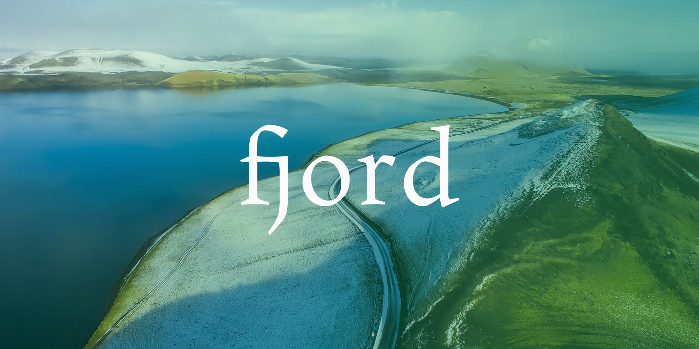

# fjord

[](https://circleci.com/gh/iktakahiro/fjord/tree/master)

fjord is a Go lang *Struct/databaseRecord Mapper* package.



## Driver support

* MySQL 5.6
* (PostgreSQL)

## Go versions

- 1.8

But fjord does not support context yet. I'll update it.

## Install

```bash
go get "github.com/iktakahiro/fjord"
```

If you use [glide](https://github.com/Masterminds/glide):

```bash
glide get "github.com/iktakahiro/fjord"
```

## Getting Started

```go
import (
    _ "github.com/go-sql-driver/mysql"
    "github.com/iktakahiro/fjord"
)


dsn := "fj_test:password@tcp(127.0.0.1:3306)/fj_test?charset=utf8mb4,utf8"
conn, _ := fjord.Open("mysql", dsn)

sess := conn.NewSession(nil)

var suggestion Suggestion

sess.Select("id", "title").
    From("suggestions").
    Where("id = ?", 1).
    Load(&suggestion)
```

## JOIN using Tag and Identifier (**Experimental**)

This syntax is one of the key features in fjord.

```go
import (
    _ "github.com/go-sql-driver/mysql"
    fj "github.com/iktakahiro/fjord"
)

type Person struct {
    ID   int    `db:"p.id"` // "p" is the alias name of "person table", "id" is a column name.
    Name string `db:"p.name"`
}

type Role struct {
    PersonID int    `db:"r.person_id"`
    Name     string `db:"r.name"`
}

type PersonForJoin struct {
    Person
    Role
}

// ...

person := new(PersonForJoin)

sess.Select(fj.I("p.id"), fj.I("p.name"), fj.I("r.person_id"), fj.I("r.name")).
    From(fj.I("person").As("p")).
    Left(fj.I("role").As("r"), "p.id = r.person_id").
    Where("p.id = ?", 1)
    Load(person)

// In MySQL dialect:
// SELECT `p`.`id` AS p__id, `p`.`name` AS p__Name, `r`.`person_id` r__person_id, `r`.`name`
//    FROM `person` AS p
//    LEFT JOIN `role` AS r on p.id = r.person_id
//    WHERE p.id = 1;
//
// Results of mapping:
//     person.id      => PersonForJoin.Person.ID
//     person.name    => PersonForJoin.Person.Name
//     role.person_id => PersonForJoin.Role.PersonID
//     role.name      => PersonForJoin.Role.Name
```

When a tag contains ".", converts a column name for loading destination into the alias format.

- `db:"p.id"` => `p__id`

And, when you use `I()` function in a select statement, a column alias is generated automatically.

- `Select(I("p.id"))` => `SELECT p.id AS p__id FROM...`

The above syntax is same as:

- `Select(I("p.id").As("p__id"))`
- `Select("p.id AS p__id")`

## CRUD

CRUD example using the bellow struct.

```go
type Suggestion struct {
    ID    int64
    Title string
    Body  fjord.NullString
}
```

### SELECT

```go
var suggestion Suggestion

sess.Select("id", "title").
    From("suggestion").
    Where("id = ?", 1).
    Load(&suggestion)
```

You can implement as a method:

```go
func (s *Suggestion) LoadByID(sess *fjord.session) (count int, err error) {
    count, err = sess.Select("id", "title").
    From("suggestion").
    Where("id = ?", s.ID).
    Load(&s)
           
    return
}

// suggestion := &Suggestion{ID: 1}
// count, err := suggestion.LoadByID(sess)
```

### INSERT

```go
suggestion := &Suggestion{Title: "Gopher", Body: "I love Go."}

sess.InsertInto("suggestion").
    Columns("title", "body").
    Record(suggestion).
    Exec()
```

As a method:

```go
func(s *Suggestion) Save(sess *fjord.session) (err error) {
    err = sess.InsertInto("suggestion").
        Columns("title", "body").
        Record(s).
        Exec()
           
    return
}
```

You can also set values to insert directly:

```go
sess.InsertInto("suggestion").
    Columns("title", "body").
    Values("Gopher", "I love Go.").
    Exec()
```

Inserting multiple records:

```go
sess.InsertInto("suggestion").
    Columns("title", "body").
    Record(suggestion1).
    Record(suggestion2).
    Exec()
```

### UPDATE

```go
sess.Update("suggestions").
    Set("title", "Gopher").
    Set("body", "We love go.").
    Where("id = ?", 1).
    Exec()
```

`SetMap()` is helpful when you need to update multiple columns.

```go
setMap := map[string]interface{}{
    "title": "Gopher",
    "body":  "We love go.",
}

sess.Update("suggestion").
    SetMap(setMap).
    Where("id = ?", 1).
    Exec()
```

### DELETE

```go
sess.DeleteFrom("suggestion").
    Where("id = ?", 1).
    Exec()
```

`Soft Delete` is not implemented, use `Update()` manually.

```go
sess.Update("suggestion").
    Set("deleted_at", time.Now().Unix()).
    Where("id = ?", 1).
    Exec()
```

## Transactions

```go
tx, err := sess.Begin()
if err != nil {
        return err
}
defer tx.RollbackUnlessCommitted()

// do stuff...

return tx.Commit()
```

## Load database values to struct fields

```go
// Columns are mapped by tag then by field
type Suggestion struct {
    ID     int64            // id
    Title  string           // title
    Url    string           `db:"-"` // ignored
    secret string           // ignored
    Body   fjord.NullString `db:"content"` // content
    User   User
}

// By default, fjord converts CamelCase field names to snake_case column_names
// You can override this with struct tags, just like with JSON tags
type Suggestion struct {
    Id        int64
    Title     fjord.NullString `db:"subject"` // subjects are called titles now
    CreatedAt fjord.NullTime
}

var suggestions []Suggestion
sess.Select("*").From("suggestion").Load(&suggestions)
```

## Table name alias

```go
sess.Select("s.id", "s.title").
    From(fjord.I("suggestion").As("s")).
    Load(&suggestions)
```

## JOIN

```go
sess.Select("*").From("suggestion").
  Join("subdomain", "suggestion.subdomain_id = subdomain.id")

sess.Select("*").From("suggestion").
  LeftJoin("subdomain", "suggestions.subdomain_id = subdomain.id")

sess.Select("*").From("suggestion").
  RightJoin("subdomain", "suggestion.subdomain_id = subdomain.id")

sess.Select("*").From("suggestion").
  FullJoin("subdomain", "suggestion.subdomain_id = subdomain.id")
```

You can join on multiple tables:

```go
sess.Select("*").From("suggestion").
  Join("subdomain", "suggestion.subdomain_id = subdomain.id").
  Join("account", "subdomain.account_id = account.id")
```

## Sub Query

```go
sess.Select("count(id)").From(
    fjord.Select("*").From("suggestion").As("count"),
)
```

## IN

```go
ids := []int64{1, 2, 3, 4, 5}
builder.Where("id IN ?", ids) // `id` IN ?
```

## Union

```go
fjord.Union(
    fjord.Select("*"),
    fjord.Select("*"),
)

fjord.UnionAll(
    fjord.Select("*"),
    fjord.Select("*"),
)
```

Union can be used in subquery.

```go
fjord.Union(
    fjord.Select("*"),
    fjord.Select("*"),
).As("u1")

fjord.UnionAll(
    fjord.Select("*"),
    fjord.Select("*"),
).As("u2")
```

## Building WHERE condition

* And
* Or
* Eq
* Neq
* Gt
* Gte
* Lt
* Lte

```go
fjord.And(
    fjord.Or(
        fjord.Gt("created_at", "2015-09-10"),
        fjord.Lte("created_at", "2015-09-11"),
    ),
    fjord.Eq("title", "hello world"),
)
```

## Plain SQL

```go
builder := fjord.SelectBySql("SELECT `title`, `body` FROM `suggestion` ORDER BY `id` ASC LIMIT 10")
```

## JSON Friendly Null* types

Every tries to JSON-encode a sql.NullString? You get:

```json
{
    "str1": {
        "Valid": true,
        "String": "Hi!"
    },
    "str2": {
        "Valid": false,
        "String": ""
  }
}
```

Not quite what you want. fjord has fjord.NullString (and the rest of the Null* types) that encode correctly, giving you:

```json
{
    "str1": "Hi!",
    "str2": null
}
```

## Tips

Is the package name too long for humans? Set an alias.

```go
import (
    fj "github.com/iktakahiro/fjord"
)

condition := fj.Eq("id", 1)
```

## Thanks

### gocraft/dbr

fjord is [gocraft/dbr](https://github.com/gorcraft/dbr) fork. gocraft/dbr is a suitable package in many cases.

I'm deeply grateful to the awesome project.

### Pictures

The pretty beautiful picture is taken by [@tpsdave](https://pixabay.com/en/users/tpsdave-12019/).

